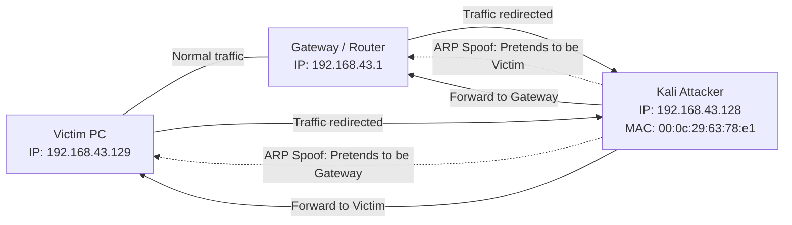

##  Objective

Understand and demonstrate common network attacks, analyze their impact on system availability, and explore potential mitigation strategies.

---

#  Part 1: Denial of Service (DoS) – ICMP Ping Flood

## Overview

A **Ping Flood** is a Denial of Service (DoS) attack where an attacker overwhelms a target system by sending a large number of **ICMP Echo Request** packets. The objective is to exhaust system resources and degrade network performance.

## Attack Execution

**Method**

* The attack was performed using `hping3` in flood mode.

**Protocol**

* ICMP (Internet Control Message Protocol)

**Observation**

* Unlike SYN or UDP floods, this attack specifically targets the **ICMP handling capacity** of the victim system.

## Results & Impact

**Increased Latency**

* The victim machine experienced significantly slower response times.

**Network Congestion**

* Continuous ICMP packets were observed during packet capture, causing noticeable traffic spikes.

**Availability Impact**

* This attack directly affected the **Availability** component of the **CIA triad**, demonstrating how excessive traffic can disrupt system functionality.

---

#  Part 2: Network Reconnaissance – Port Scanning

## Objective

Identify open ports and running services on a target machine in order to discover potential vulnerabilities and plan subsequent attacks.

## Scanning Techniques

Using **nmap**, two primary scanning methods were used.

### TCP Stealth Scan (`-sS`)

**Mechanism**

* Sends SYN packets and waits for SYN-ACK responses.

**Advantage**

* Faster and more discreet than a full connection scan because it does **not complete the TCP three-way handshake**.

### UDP Scan (`-sU`)

**Mechanism**

* Attempts to identify open UDP ports.

**Detection Logic**

* If an **ICMP "Port Unreachable"** message is returned, the port is closed.
* If there is **no response**, the port may be open or filtered.

## Findings

* By default, Nmap scans the **1000 most common TCP ports**.
* The scan successfully mapped exposed services running on the victim machine.

**Target IP:** `192.168.43.129`

---

#  Part 3: Man-in-the-Middle (MITM) via ARP Poisoning

## Vulnerability Analysis

The **Address Resolution Protocol (ARP)** does not include authentication mechanisms.
This allows attackers to send **forged ARP responses** to associate their MAC address with the IP address of another device (such as the gateway).

## Attack Process

The attack was performed using **Ettercap**, and later **Bettercap** for automation.

### Traffic Redirection

The attack altered network routing as follows:

```
Victim → Gateway
```

became

```
Victim → Attacker → Gateway
```

This allowed the attacker to intercept and potentially modify network traffic.

### Lab Environment

* **Attacker:** Kali Linux
* **Victim:** Windows 7
* **Configuration:** One-way ARP poisoning

### Verification

The success of the attack was confirmed using two methods:

**ARP Table Inspection**

* The Windows ARP table displayed the attacker's MAC address associated with the gateway's IP address.

**Packet Capture**

* Network monitoring confirmed that victim traffic was passing through the attacker's machine.

---

#  Countermeasures Against ARP Spoofing

Several security mechanisms can reduce the risk of ARP poisoning attacks.

**Static ARP Entries**

* Manually mapping IP addresses to MAC addresses for critical devices.

**Dynamic ARP Inspection (DAI)**

* Switch-level protection that validates ARP packets before forwarding them.

**Encryption**

* Using **HTTPS, SSH, or VPNs** ensures data remains confidential even if intercepted during a MITM attack.

---

#  Attack Automation with Bettercap

## Process

**Bettercap** was used as a more automated alternative to Ettercap for performing ARP spoofing and traffic interception.

### Network Discovery

```
net.probe on
```

Discovers all active hosts on the local network.

### ARP Spoofing

```
arp.spoof on
```

Initiates the ARP poisoning attack against detected targets.

### Packet Sniffing

```
net.sniff on
```

Captures and analyzes intercepted network traffic automatically.

---

#  Conclusion

This lab demonstrated several key attack techniques used in real-world network security testing:

* **ICMP Ping Floods** can disrupt system availability through excessive traffic.
* **Port Scanning** helps attackers identify exposed services and potential vulnerabilities.
* **ARP Poisoning** enables Man-in-the-Middle attacks due to the lack of authentication in ARP.

Understanding these techniques helps security professionals implement effective defenses, including traffic monitoring, secure protocols, and network-layer protections.



